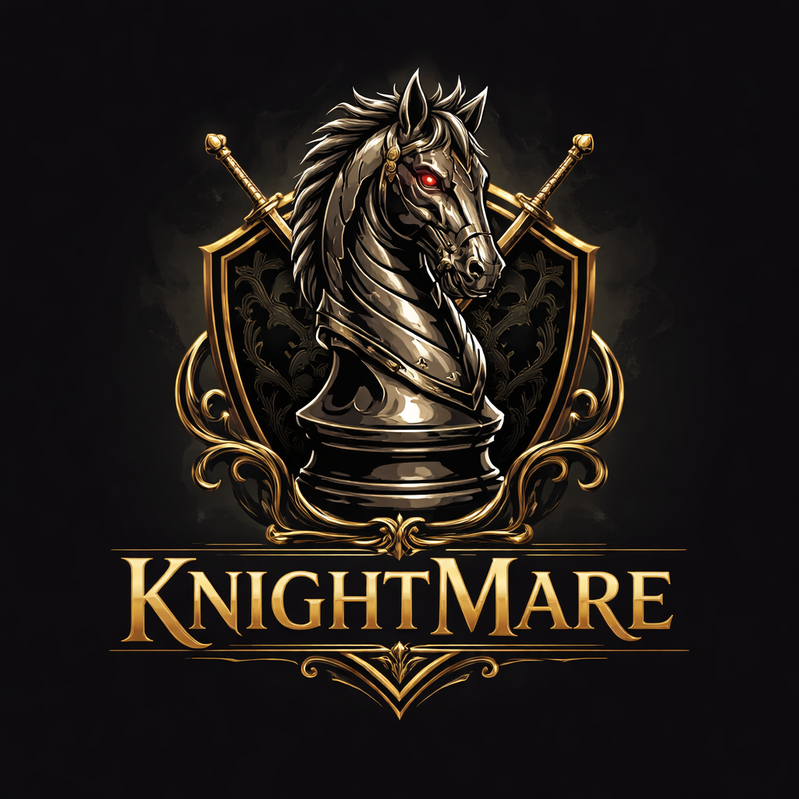

# KNIGHTMARE



A chess engine written in C++ just for fun and to learn. This is a work in progress :— move generation is done, perft testing is underway, and search/evaluation is next.

---

## How it works

### Board Representation

The board is represented using **bitboards** — one 64-bit integer per piece type per color. So `bitboards[WHITE][KNIGHT]` is a single `uint64_t` where each set bit represents a white knight on that square. This makes move generation extremely fast since most operations are just bitwise AND/OR/XOR.

Alongside the piece bitboards, three occupancy bitboards are maintained — one for white, one for black, and one for both combined. These are kept in sync on every `placePiece` and `removePiece` call.

The board also tracks:
- Side to move
- Castle rights (stored as a 4-bit mask)
- En passant square (-1 if none)

### Attack Table Precomputation

Before any game logic runs, `PreMatchAttackComputation::init()` precomputes every possible attack from every square for every piece type. These are stored as static lookup tables.

For sliding pieces (rook, bishop, queen), attacks are split **by direction** — north, south, east, west, and the four diagonals. This is the key insight that makes `isSquareAttacked` efficient: instead of computing attacks on the fly, you cast a ray in each direction from the target square and check the nearest blocker.

**Important:** `init()` must be called before anything else in `main`. If you forget it, all attack tables are zero and no moves get generated — learned this the hard way.

### Move Generation

Move generation is split into two stages:

**Pseudo-legal moves** (`GeneratePseudoLegalMove`) — generates all moves a piece could make ignoring whether it leaves the king in check. Fast, no board state changes needed.

**Legal move filtering** (`LegalMoveFilter`) — for each pseudo-legal move, saves board state, makes the move, checks if the king is in check, then restores the board. Only moves that don't leave the king in check survive.

*believe me it is not easy to do.*

This save/restore pattern uses a `BoardState` struct that snapshots all bitboards, occupancies, castle rights, en passant square, and side. Bitboards and occupancies are `std::array` so restoring is just a direct assignment.

### isSquareAttacked

The core of legality checking. Given a square and a color, it asks: "is this square attacked by the enemy?"

The approach is **pretend to be the attacker**:
- Cast rook rays from the square → if you hit an enemy rook or queen, you're attacked
- Cast bishop rays from the square → if you hit an enemy bishop or queen, you're attacked
- Use knight attack table from the square → if an enemy knight sits there, you're attacked
- Use your own pawn attack mask from the square → if an enemy pawn sits there, you're attacked

`isKingInCheck` is just a thin wrapper that finds the king's square and calls `isSquareAttacked`.

### Make / Unmake

`Board::makeMove` handles the mechanical side:
- Remove piece from source square
- Place piece on destination square
- Handle captures (including en passant)
- Move the rook if castling

`Board::unmakeMove` restores the full `BoardState` snapshot. The reason these are separate functions rather than one combined function is search — minimax needs to make a move, recurse deeper, then unmake it. The make and unmake are separated by an entire recursive call stack.


## Perft

Perft (performance test) is used to verify move generation correctness. It walks the legal move tree to a given depth and counts leaf nodes, then compares against known values.

```
runPerftSuite(board, STARTING_POSITION_PERFT, "Starting Position");
```

If a depth fails,run `perftDivide` which prints per-move node counts. You compare those against the published values on the Chess Programming Wiki to isolate exactly which move is wrong.

Known perft values are in `types_constants/constants.h` for the starting position and Kiwipete (a position specifically designed to stress-test castling and en passant).

---

## What's next

- [ ] Perft passing for starting position and Kiwipete
- [ ] Castle rights update on king/rook moves
- [ ] Evaluation function
- [ ] Minimax with alpha-beta pruning
- [ ] Move ordering